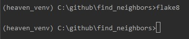

# find_neighbors

REST-сервис для поиска соседей. 
Основная функция - сервис должен позволить запросить K ближайших соседей пользователя N в радиусе M километров.

Помимо этого сервис должен позволять выполнять простейшие CRUD-действия над пользователями - создавать пользователя с координатами (2D, на плоскости, сфере или геоиде - не суть), модифицировать информацию о нём (координаты, какое-нибудь описание - по желанию), удалять.

У вас десять миллионов пользователей

### Описание

API со следующим набором эндпоинтов:

    • /v1/         - GET метод. 
                     Получение количества пользователей.
                             
    • /v1/user     - GET, POST, PUT и DELTE методы. 
                     CRUD над пользователями
    
    • /v1/neighbor - GET метод. 
                     Получить K ближайших соседей пользователя N в радиусе M.

Сервис работает на ``python 3.7``.

Фреймворк для написания API — ``aiohttp``. 

Библиотека для создания простенького REST API ``aiohttp_rest_api``
Документация: [https://aiohttp-rest-api.readthedocs.io/](https://aiohttp-rest-api.readthedocs.io/)

Конфиг приложения находится: [/config/config.toml](config/config.toml)

## Getting started
Для запуска необходимо выполнить команду: `docker-compose up -d`

После запуска раскатится docker контейнер:

    • Контейнер веб приложения на http://127.0.0.1 по умолчанию

Файл [PostmanCollection](Find_Neighbors.postman_collection.json) содержит
примеры запросов на все API, который можно импортнуть в Postman

### Локальный запуск приложения

Настрока через PyCharm:

### flake8

### timeit 

    Gen users is done for 0.0 sec
    Make tree...
    Make tree is done for 0.0 sec
    Get neighbors...
    100 items: get_neighbors takes 0.113 for 1000 runs
    
    Gen users...
    Gen users is done for 0.004 sec
    Make tree...
    Make tree is done for 0.001 sec
    Get neighbors...
    1000 items: get_neighbors takes 0.113 for 1000 runs
    
    Gen users...
    Gen users is done for 0.039 sec
    Make tree...
    Make tree is done for 0.01 sec
    Get neighbors...
    10000 items: get_neighbors takes 0.116 for 1000 runs
    
    Gen users...
    Gen users is done for 0.409 sec
    Make tree...
    Make tree is done for 0.114 sec
    Get neighbors...
    100000 items: get_neighbors takes 0.123 for 1000 runs
    
    Gen users...
    Gen users is done for 4.027 sec
    Make tree...
    Make tree is done for 1.346 sec
    Get neighbors...
    1000000 items: get_neighbors takes 0.123 for 1000 runs
    
    Gen users...
    Gen users is done for 43.755 sec
    Make tree...
    Make tree is done for 12.833 sec
    Get neighbors...
    10000000 items: get_neighbors takes 0.15 for 1000 runs
    
### Мысли и проблемы

    • Пришлось пожертвовать оперативной памятью
    
        N = 100        | Size of list: 42K
        N = 1000       | Size of list: 412K
        N = 10_000     | Size of list: 3M
        N = 100_000    | Size of list: 41M
        N = 1_000_000  | Size of list: 407M
        N = 10_000_000 | Size of list: 3G
    
    • Из-за п.1 есть временной промежуток для запуска REST API
           
    • Оказалось, что для большого количества данных N = 10_000_000, лучше 
    будет использовать метод query, а потом отфильтровать дистанции по радиусу  

       cKDTree.query(xy, k=k) and filter     0.00033 sec
       cKDTree.query_ball_point(xy, radius)  0.46180 sec
       
      